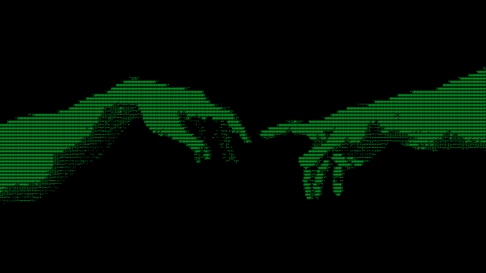

[Know More About Me](https://junaidahamed.runs-on.dev)
---
```text
⠀⠀⠀⠀⠀⠀⠀⠀⠀⠀⠀⠀⠀⠀⠀⢀⠀⠀⠀⡀⣄⣂⣠⣤⣤⣤⣄⠀⣀⢀⠀⣀⠀⠀⠀
⠀⠀⠀⠀⠀⠀⠀⠀⠀⠀⣀⣠⣶⣶⣿⣷⣾⣦⣵⣽⣾⣿⣿⣿⣾⣿⣿⣿⣿⣿⣶⣬⡀⡈⠀They rode on. The sun past its meridian turned conversionward
⠀⠀⠀⠀⠀⠀⠀⠀⢀⣰⣾⣿⣿⣿⣿⣿⣿⣿⣿⣿⣿⣿⣿⣿⣿⣿⣿⣿⣿⣿⣿⣿⣿⣷⣧⣂⠀and the world on the tablet of whose face they were no more
⠀⠀⠀⠀⠀⢀⠀⣜⣽⣿⣿⣿⣿⣿⣿⣿⢿⣿⣿⣿⣿⣿⣿⣿⣿⣿⣿⣿⣿⣿⣿⣿⣿⣿⣿⣿⣷⡀⠠⣄than strays or chapters in some chronicle of the past began to
⠀⠀⠀⠀⢀⢠⣾⣿⣿⣿⣿⣿⣿⣿⣿⢋⠟⣯⢿⣿⣿⣿⣿⡿⢽⣿⣿⣿⣿⣿⣿⣿⣿⣿⣿⣿⣿⣿⣦⡀⠀⡀recover its color. A vast wetness overspread the playa.
⠀⠀⠀⣰⣶⣿⣿⣿⣿⣿⣿⣿⣿⣿⣇⡀⢐⠻⣝⡇⣿⣿⣿⡟⣿⣾⣿⣿⣿⣿⣿⣿⣿⣿⣿⣿⣿⣿⣿⣦⠄⠑⡀The horses picked their way through the standing water
⠀⢀⣴⣿⣿⣿⣿⣿⣿⣿⣿⣿⣿⣿⣏⡀⠀⢄⡑⢿⣾⣿⣿⣿⣿⣿⣿⣿⣧⣧⣿⣿⣿⣿⣿⣿⣿⣿⣿⣿⣿⡀⢩⠀and the riders sat slumped and sodden in their saddles.
⣴⣽⣿⣿⣿⣿⣿⣿⣿⣿⣿⣿⣿⣿⣿⣵⣄⡀⠀⠁⠹⣿⣿⣿⣿⣿⣿⣿⣿⣿⣾⣿⣿⣿⣿⣿⣿⣿⣿⣿⣿⡏⢗⢁ They crossed a limestone ridge where the rocks were
⣵⣿⣿⣿⣿⣿⣿⣿⣿⣿⣿⣿⣿⣿⣿⣿⣾⣶⣶⣢⣶⣼⣿⣿⣿⣯⠋⠻⠝⠉⠀⠉⠺⣿⣿⣿⣿⣿⣿⣿⣿⣿⡖⢮⠂ white as bones and they entered a basin that was dry⠀⠀⠀
⣿⣿⣿⣿⣿⣿⣿⣿⣿⣿⣿⣿⣿⣿⣿⣿⣿⣿⡿⠿⠹⠿⠿⠹⠿⡿⠇⠀⠀⠀⠀⠀⡸⠿⠿⠉⠏⠉⢹⣿⣿⣿⣿⡇⡆ and white and alkaline and smelled of sulfur.⠀
⣿⣿⣿⣿⣿⣿⣿⣿⣿⣿⣿⣿⣿⣿⠟⠛⠁⠀⠀⠀⠀⠀⠀⠀⠀⠀⠀⠀⠀⠀⠀⠀⢄⠄⠀⠀⠀⠀⠀⠘⣿⣿⣿⣿⣼⣀⠀The sun rode down the sky and the shadows of the riders
⣿⣿⣿⣿⣿⣿⣿⣿⣿⣿⣿⡿⣿⡟⢋⡀⢀⣤⣀⠄⡢⡤⠀⡀⡀⠀⠀⠀⠀⠀⠀⠀⢦⡂⣴⣂⣀⣄⠠⠀⢿⣿⣿⣿⣿⡤⡀⠀lengthened across the valley floor until they reached
⣿⣿⣿⣿⣿⣿⣿⣿⣿⣿⣿⣿⣿⡇⣡⣯⣾⣿⣿⣿⣿⣿⣿⣿⣿⠀⠀⠀⠀⠀⠀⠀⠀⠘⠻⣿⣿⡿⢿⣿⣾⣿⣿⣿⣿⣧⣃⢠⡀ the base of the eastern mountains where they rose up
⣿⣿⣿⣿⣿⣿⣿⣿⣿⣿⣿⡼⣿⡿⢿⣿⣿⣿⣟⣿⣿⣷⠾⠃⠈⠀⠀⠀⠀⢀⠀⠀⠠⡀⣀⠘⠘⠛⢿⡿⠛⢿⣿⣿⠿⢻⣑⣲⠟ the dark slopes like giant geometricians or ⠀
⣿⣿⣿⣿⣿⣿⣿⣿⣿⣿⢃⡾⢏⠚⡀⠀⠉⠉⠋⠙⠋⠀⠀⠀⠀⠀⠀⠀⢠⠉⢀⣴⣶⡄⣇⣮⠁⠀⢀⠀⠀⠀⠛⠁⣀⢔⠝⠁⠀surveyors measuring the world. The night 
⣿⣿⣿⣿⣿⣿⣿⣿⣿⣧⣟⠑⠀⠀⠈⠒⠀⠐⠀⠀⠈⠀⠀⠀⠀⠀⠀⠀⢯⣦⠘⠛⠉⠚⡘⠉⠄⠀⠀⠀⠀⠀⡠⢒⣵⣿⡆⠀gave definition to their journey. They rode under 
⣿⣿⣿⣿⣿⣿⣿⣿⣿⣿⣧⣀⣀⣠⠤⡂⠈⠀⠀⠀⠀⠀⠀⠀⠀⠀⠀⠀⠀⠉⠉⠁⠠⡒⢂⢨⢴⡄⠄⠀⣤⡪⠂⢸⣿⣿⣿⣄⠀a canopy of stars that burned with a fierce and
⣿⣿⣿⣿⣿⣿⣿⣿⣿⣿⣛⠛⠮⡤⠀⠀⠀⠀⠀⠀⠀⠀⠀⠀⠀⠀⠀⠀⠀⠀⡠⣺⢾⣿⣿⡾⠊⢀⣼⠞⠀⠀⠀⢸⣿⣿⣿⣿⣦ ancient light, a cold and indifferent clockwork
⣿⣿⣿⣿⣿⣿⣿⣿⣿⣿⣄⡸⠈⠉⠁⠂⠀⠀⠀⠀⠀⠀⠀⠀⠀⠀⠀⠀⠀⢠⣲⣷⣟⢿⠋⣁⣾⣿⣿⡇⠀⠀⠀⢸⣿⣿⣿⣿⣿⡥ that turned above the vast and empty wastes of the earth.
⣿⣿⣿⣿⣿⣿⣿⣿⣿⣿⣷⠬⠀⠀⠀⠀⠀⠀⠀⠀⠀⠀⠀⠀⠀⠀⠀⠀⠰⣿⢟⢛⡻⡋⡟⠉⠕⣉⢩⣿⣄⠀⠀⣸⣿⣿⣿⣿⣿⣧ The world through which they traveled seemed 
⣿⣿⣿⣿⣿⣿⣿⣿⣿⣿⣿⣿⡆⠀⠀⠀⠀⠀⠀⠀⠀⠀⠀⠀⠀⠀⠀⠀⠀⠀⠈⢩⣿⣿⣿⣿⣿⣿⡿⠀⠠⠂⠀⣿⣿⣿⣿⣿⣿⣿ a thing unmade, a raw and unfinished blueprint where
⣿⣿⣿⣿⣿⣿⣿⣿⣿⣿⣿⣿⣷⣁⠀⠀⠀⠀⠀⠀⠀⠀⠀⠀⠀⠀⠀⠀⠀⠀⠀⠈⠉⠉⠉⠉⠉⠁⠀⠀⠀⠸⢠⣿⣿⣿⣿⣿⣿⣿ the elements still warred in the dark and the
⣿⣿⣿⣿⣿⣿⣿⣿⣿⣿⣿⡿⣿⣿⣒⡀⠀⠀⠀⠀⠀⠀⠀⠀⠀⠀⠀⠀⠀⠀⠀⠀⠀⠀⠀⠀⠀⠀⠀⠀⠀⠠⣼⣿⣿⣿⣿⣿⣿⣿ spirit of God had not yet moved upon the face of the 
⣿⣿⣿⣿⣿⣿⣿⣿⣿⣿⣿⣿⣿⣿⣿⣶⣳⣀⢀⠀⠀⠀⠀⠀⠀⠀⠀⠀⠀⠀⠀⠀⠀⠀⠀⠀⠀⠀⠀⠀⠀⣰⣿⣿⣿⣿⣿⣿⣿⣿ waters. They moved like men destined to 
⣿⣿⣿⣿⣿⣿⣿⣿⣿⣿⣿⣿⣿⣿⣿⣿⣷⣾⣿⣹⢧⢲⢦⠔⠦⢄⣄⣠⣢⠤⡢⢄⣠⣀⣠⢄⡤⣠⠠⢀⣴⣿⣿⣿⣿⣿⣿⣿⣿⣿ a common grave, their faces shadowed beneath 
⣿⣿⣿⣿⣿⣿⣿⣿⣿⣿⣿⣿⣿⣿⣿⣿⣿⣿⣿⣿⣿⣷⣾⣿⣿⣿⢾⣿⡟⡿⣿⡿⢯⣯⣽⣾⣷⣷⣾⣿⣿⣿⣿⣿⣿⣿⣿⣿⣿⣿ the brims of their hats, silent, austere, engulfed
Blood Meridian⣿⣿⣿⣿⣿⣿⣿⣿⣿⣿⣿⣿⣿⡷⡿⣿⣏⢳⡞⡵⠩⢜⢿⢟⣿⣿⣿⣿⣿⣿⣿⣿⣿⣿⣿⣿⣿⣿⣿⣿ by a silence so profound that the ticking of
by Cormac McCarthy⣿⣿⣿⣿⣿⣿⣿⣿⣿⢯⣿⣝⢦⢛⡖⢴⢫⠒⣁⣾⣿⣿⣿⣿⣿⣿⣿⣿⣿⣿⣿⣿⣿⣿⣿⣿ their horses' hooves upon the stone sounded like
⣿⣿⣿⣿⣿⣿⣿⣿⣿⣿⣿⣿⣿⣿⣿⣿⣿⣿⣿⣿⣿⡿⣏⣿⢱⠾⣏⠏⡾⣶⠉⠀⢹⣿⣿⣿⣿⣿⣿⣿⣿⣿⣿⣿⣿⣿⣿⣿⣉⠀the counting out of their own brief and numbered days.
```
---

## Featured Projects
> Source Code of "Heimdall" and "TypeShift" is pinned below. 
- [Heimdall](https://heimdall-productivity-companion-1091650404271.asia-southeast1.run.app) — AI-Powered productivity companion
- [TypeShift](https://typeshift-alpha2.vercel.app) — Typing speed platform built with React
- [Emotion Detector](https://github.com/JunaidAhamed-7777/Emotion_detector_music_rcmdr) — Real-time emotion-based music recommendation using MediaPipe and TensorFlow
- [Binance Futures Trading Bot](https://github.com/JunaidAhamed-7777/trading_bot/tree/main) — Python CLI trading bot that safely validate, execute, log market & limit orders on Binance USDT
- [Blackwall](https://github.com/JunaidAhamed-7777/Blackwall) — A platform that streamlines the process where requests can be posted, reviewed and approved.
- [Crystal UI (Vivaldi)](https://github.com/JunaidAhamed-7777/CrystalUI_Vivaldi) — Frosted glass UI customization for Vivaldi browser (Inspired from iOS, partly)
- [AirQuality Monitor (ESP32)](https://github.com/JunaidAhamed-7777/AirQuality-Humidity-PPM-Monitor-using-ESP32) — Embedded environmental monitoring system with sensor calibration and alerting.
---
## Stack
          
<!---

--->


[Nothing ends poetically. Things end, and we turn it into poetry.](https://open.spotify.com/playlist/2x67eFjtZh3MKbHBo8ZHbw?si=20f137bf7df447f5)
<!-- https://github.com/JunaidAhamed-7777 
[] ([https://github.com/pranesh-2005](https://github.com/JunaidAhamed-7777)/github-readme-stats-fast)
--->
